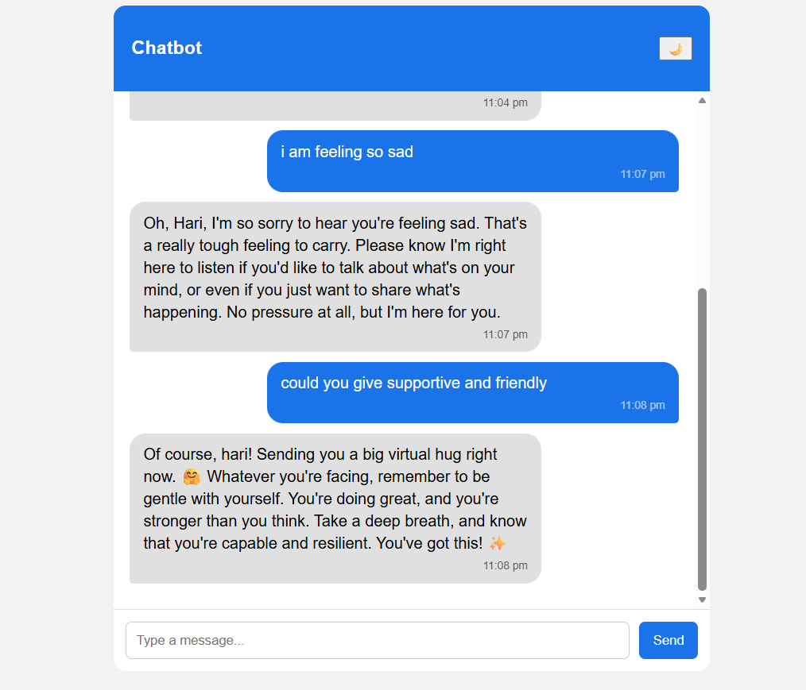
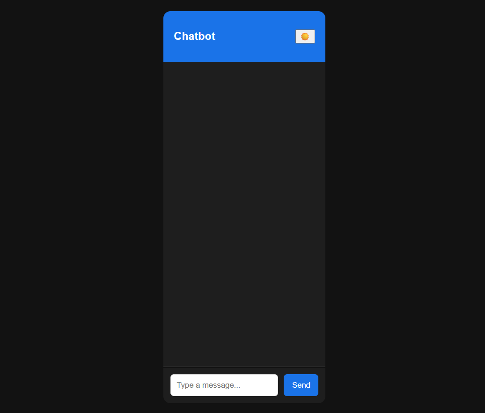

# AI Chatbot with Context & Memory

## 📌 Overview
This project is an AI-powered chatbot built using **React** for the frontend and **Node.js with Express** for the backend.  
It integrates the **Google Gemini API** to generate intelligent, human-like responses and uses **MongoDB** to store persistent user memory.

The chatbot maintains conversational context, remembers user-specific information across sessions, and responds with an empathetic and consistent tone.

---

## ✨ Features
- Context-aware conversations
- Persistent memory across sessions (MongoDB)
- Human-like and empathetic responses
- Chat bubbles with timestamps
- Typing indicator
- Scroll-to-bottom button
- Persistent dark mode
- Responsive and mobile-friendly UI

---

## 🏗️ Tech Stack

### Frontend
- React (Vite)
- Axios
- Custom CSS

### Backend
- Node.js
- Express.js
- MongoDB (Mongoose)
- Google Gemini API (`gemini-2.5-flash`)
- dotenv

---

## 📂 Project Structure

```
stan/
├─ frontend/
│ ├─ src/
│ │ ├─ components/
│ │ │ └─ Chat.jsx
│ │ ├─ App.jsx
│ │ ├─ main.jsx
│ │ └─ index.css
│ └─ package.json
│
├─ backend/
│ ├─ models/
│ │ └─ User.js
│ ├─ routes/
│ │ └─ chat.js
│ ├─ services/
│ │ └─ gemini.js
│ ├─ server.js
│ ├─ .env
│ └─ package.json
│
├─ screenshots/
│ ├─ chat-ui.png
│ ├─ memory-recall.png
│ └─ dark-mode.png
│
├─ README.md
├─ .gitignore
├─ package.json
└─ package-lock.json
```

---

## ⚙️ Setup Instructions (Local)

### Prerequisites
- Node.js (v18 or higher)
- MongoDB (local or MongoDB Atlas)
- Google Gemini API Key

---

### 🔹 Backend Setup

```bash
cd backend
npm install
```

Create a `.env` file inside the `backend` folder:

```env
PORT=5000
MONGO_URI=mongodb://127.0.0.1:27017/chatbot
GEMINI_API_KEY=your_gemini_api_key_here
```

Start the backend server:

```bash
npm start
```

Backend runs at:
```
http://localhost:5000
```

---

### 🔹 Frontend Setup

```bash
cd frontend
npm install
npm run dev
```

Frontend runs at:
```
http://localhost:5173
```

---

## 📸 Screenshots

### Chat Interface


### Memory Persistence


### Dark Mode



---

## 👤 Author
**Medipudi Hari Veera**
